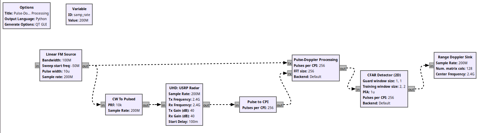

# gr-plasma: A GNU Radio module for radar signal processing




The gr-plasma module implements a number of radar signal processing functions in
GNU Radio. Due to the bursty nature of pulsed radar operation, these blocks are
implemented entirely in the message passing domain. The module
pulls much of its signal processing from
[plasma-dsp](https://github.com/ShaneFlandermeyer/plasma-dsp), which is a
general-purpose radar signal processing library intended for use outside of GNU
Radio. plasma-dsp uses [ArrayFire](https://arrayfire.com/) to enable
GPU-accelerated processing, and real-time operation has been achieved on an
Ettus X310 SDR and an NVIDIA RTX 3070 GPU at sample rates up to 100
MS/s.

The following features have been implemented:

- High-rate data streaming from
  [UHD](https://www.ettus.com/sdr-software/uhd-usrp-hardware-driver/) compatible
  software-defined radios: Transmit and receive functionality is implemented in
  a single USRP radar block, which can achieve higher sample rates than the
  stream-based UHD blocks since no overhead is incurred from the scheduler.

- Waveform generation: The module provides blocks for generating Linear FM
  waveforms with arbitrary bandwidths and pulse widths. There is also a block
  that generates [PCFM](https://ieeexplore.ieee.org/document/6965769) waveforms
  from common phase codes.

- Matched filtering for arbitrary transmitted waveforms

- Doppler processing

- Cell-averaging CFAR detection

- Range-doppler map generation (with optional detection markers)

- Utilities for reading and writing PDU data to and from files. The data is stored
  in the same format as the file source block in the main tree, and the PMT
  metadata dictionary can optionally be stored as a JSON object.  

## Installation

To install gr-plasma system-wide, you should first install
[plasma-dsp](https://github.com/ShaneFlandermeyer/plasma-dsp) using the
instructions in its README. Additional required dependencies should be installed as:

```[bash]
sudo apt install nlohmann-json3-dev
```

Next, run the following from the top-level directory of the module:

```[bash]
mkdir build
cd build
cmake ..
make
sudo make install
sudo ldconfig
```

The module can similarly be uninstalled from the top-level directory as shown below:

```[bash]
cd build
sudo make uninstall
sudo ldconfig
```

## Publications and Presentations

- https://pubs.gnuradio.org/index.php/grcon/article/view/121
- https://events.gnuradio.org/event/18/contributions/253/
